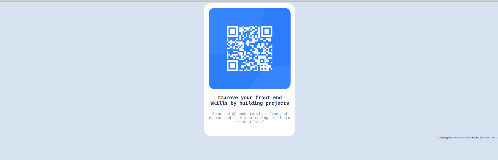

# Frontend Mentor - QR code component solution

This is a solution to the [QR code component challenge on Frontend Mentor](https://www.frontendmentor.io/challenges/qr-code-component-iux_sIO_H). Frontend Mentor challenges help you improve your coding skills by building realistic projects. 

## Table of contents

- [Overview](#overview)
  - [Screenshot](#screenshot)
  - [Links](#links)
- [My process](#my-process)
  - [Built with](#built-with)
  - [What I learned](#what-i-learned)
  - [Continued development](#continued-development)
  - [Useful resources](#useful-resources)
- [Author](#author)
- [Acknowledgments](#acknowledgments)

**Note: Delete this note and update the table of contents based on what sections you keep.**

## Overview

### Screenshot



### Links

- Solution URL: [https://lillamay.github.io/frontend/qr-code-component-main/](https://your-solution-url.com)

## My process

### Built with

- Semantic HTML5 markup
- CSS custom properties
- Flexbox

**Note: These are just examples. Delete this note and replace the list above with your own choices**

### What I learned

I learn to use what I've learned about CSS and flexbox from scratch. I've been able to write the lines completely from memory and be as close to the design as I could. As I am a complete beginner, my code is probably not reliable and not that efficient.

I learned how to import a font from Google Fonts.
```html
<head>
  <style>
    @import url('https://fonts.googleapis.com/css2?family=Outfit:wght@200&display=swap');
  </style>
</head>
```
```css
.component {
    font-family: 'Outfit', sans-serif;
    }
```

I learned how to make rounded edges corner
```css
img, .component {
    border-radius: 25px;
}
```

### Continued development

I want to continue focusing on flexbox to understand how and when it is best used, and then learn more about responsive design and the differences between desktop and mobile design.

I want to be able to write an efficient code and understand my mistakes.

### Useful resources

- [CSS Rounded Corners W3 schools](https://www.w3schools.com/css/css3_borders.asp) - This helped me to create the rounded edge corners.
- [Linuxhint how to import Google Web Font in CSS](https://linuxhint.com/how-to-import-google-web-font-in-css/) - This helped me import Google Fonts.

## Author

- Frontend Mentor - [@lillamay](https://www.frontendmentor.io/profile/lillamay)
- Github- [@lillamay](https://github.com/lillamay/frontend/tree/d8c4202ea39b6381a66988558629fd6698cfb99e/qr-code-component-main)


